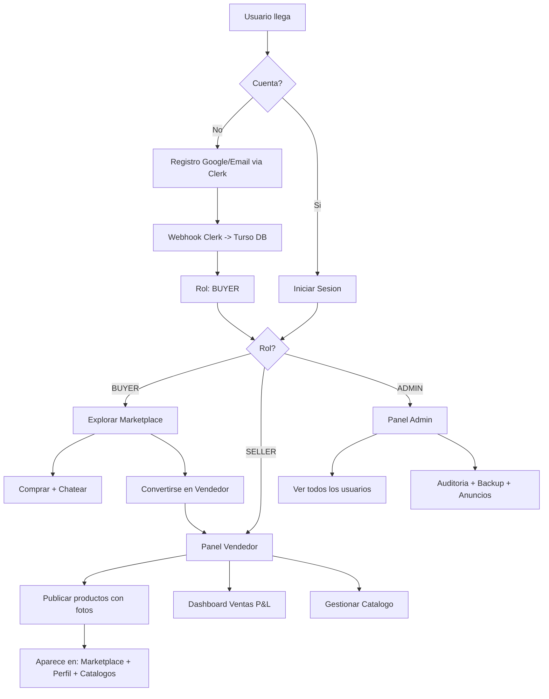
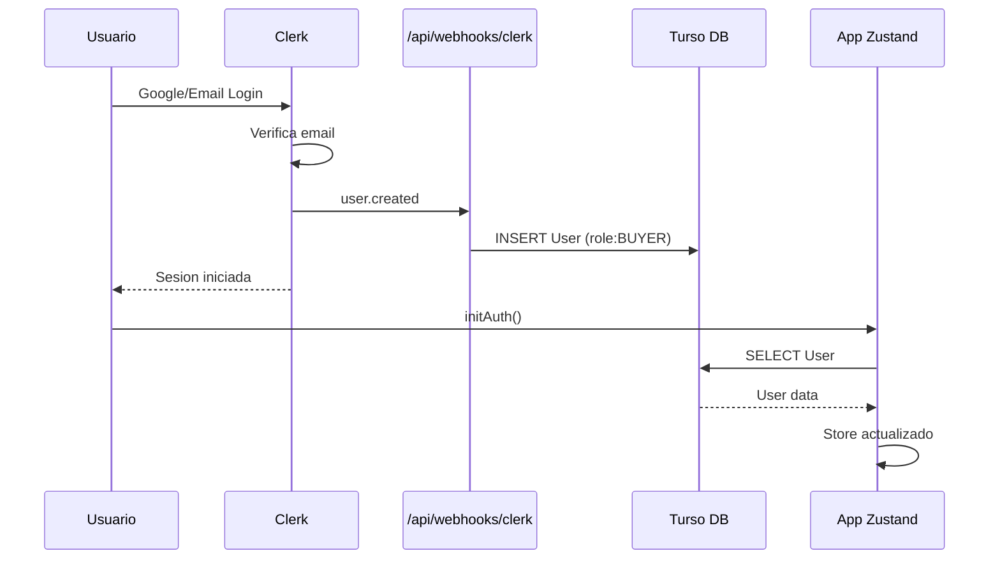
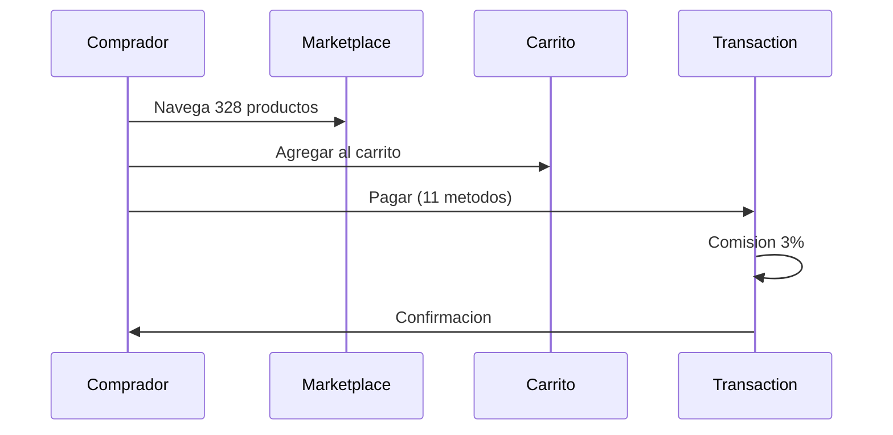
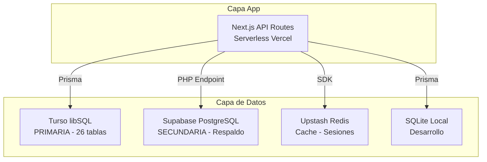

<p align="center">
  
  
  
  
  
  
  
</p>

<h1 align="center">🇳🇮 ProveedorConecta Nicaragua</h1>
<p align="center"><strong>Marketplace B2B/B2C para MIPYMES nicaragüenses</strong><br><em>Hackathon Nicaragua 2026 · 10ª Edición</em></p>
<p align="center">
  <a href="https://proveedor-conecta-vercel-github.vercel.app">🌐 Demo en Vivo</a> ·
  <a href="https://github.com/Reynaldo935/proveedor-conecta">📂 GitHub</a>
</p>

---

## 🎯 Objetivo del Proyecto

**ProveedorConecta Nicaragua** conecta proveedores locales con compradores de todo el país, ofreciendo herramientas profesionales de e-commerce adaptadas a Nicaragua.

1. **Conectar** proveedores con compradores en un marketplace digital
2. **Digitalizar** el comercio B2B/B2C nicaragüense
3. **Empoderar** MIPYMES con herramientas profesionales
4. **Facilitar** transacciones con 11 métodos de pago locales
5. **Experiencia** similar a Facebook Marketplace + Alibaba + Amazon, 100% nicaragüense

---

## 🧪 Perfiles de Prueba

| Rol | Email | Contraseña | Acceso |
|---|---|---|---|
| 👑 **Admin** | `rey7214935@gmail.com` | `El_jefe07` | Panel Admin, Auditoría, Backup, Ver TODOS los usuarios |
| 🏪 **Vendedor** | `losmunguias007@gmail.com` | `Yamoshi2007..` | Publicar productos, Catálogo, Dashboard, Chat |
| 🛒 **Comprador** | `munguiafrancisco860@gmail.com` | `perrasuciadavid` | Comprar, navegar, chatear, guardar, dar like |

> **Cualquier email Google** puede registrarse. Recibe rol `BUYER` automático. Botón **"Convertirse en Vendedor"** en el perfil para cambiar a `SELLER`.

---

## 📊 Diagramas de Flujo

### Flujo General del Usuario



### Flujo de Autenticacion (Clerk)



### Flujo de Compra



### Flujo Vendedor

```mermaid
flowchart LR
    A[BUYER] -->|Click Convertirse| B[/api/auth/role]
    B --> C[BusinessProfile creado]
    C --> D[SELLER]
    D --> E[Publicar producto + fotos]
    E --> F[Marketplace]
    E --> G[Perfil Vendedor]
    E --> H[Catalogos > Vendedores]
```


---

## 🛠️ Tecnologias Usadas

### Frontend
| Tecnologia | Version | Uso |
|---|---|---|
| Next.js | 16.2.9 | Framework React App Router |
| React | 19 | Biblioteca UI |
| TypeScript | 5 | Tipado estatico |
| Tailwind CSS | 4 | Estilos utilitarios |
| shadcn/ui | latest | 40+ componentes UI |
| Framer Motion | 11 | Animaciones |
| Zustand | 5 | Estado global |
| Recharts | 2 | Graficas Dashboard |
| Leaflet | 1.9 | Mapas interactivos |
| Lucide React | latest | Iconos |

### Backend
| Tecnologia | Uso |
|---|---|
| Next.js API Routes | 60+ Serverless Functions |
| Prisma ORM | Acceso a base de datos |
| Clerk | Autenticacion Email + Google OAuth |
| Pusher + Socket.io | Chat en tiempo real |
| n8n | Webhooks IA chatbot |
| Svix | Verificacion Webhooks |
| bcryptjs | Encriptacion |
| Zod | Validacion de datos |
| Resend | Emails transaccionales |

### Bases de Datos
| Base | Tipo | Hosting | Uso |
|---|---|---|---|
| Turso | libSQL | Turso Cloud | PRIMARIA - 26 tablas |
| Supabase | PostgreSQL | Supabase Cloud | SECUNDARIA - Respaldo |
| Upstash Redis | Redis | Upstash Cloud | Cache |
| SQLite Local | SQLite | Local | Desarrollo |

### Infraestructura
| Servicio | Uso |
|---|---|
| Vercel | Hosting + CDN + Edge Network |
| GitHub | Control de versiones |
| OpenWeatherMap | API de clima |
| Clearbit | Logos de proveedores |
| Lorem Flickr | Imagenes fallback |
| Picsum | Imagenes producto |


---

## 🗄️ Bases de Datos - Arquitectura 4 Capas



### Comparacion de Bases de Datos

| Caracteristica | Turso | Supabase | Redis | SQLite |
|---|---|---|---|---|
| Tipo | SQLite distribuido | PostgreSQL | Key-Value | SQLite |
| Uso | PRIMARIO | SECUNDARIO | Cache | Dev |
| Latencia | ~5ms edge | ~50ms | ~1ms | 0ms |
| Tablas | 26 | 26 replica | N/A | 26 |
| Backup | Auto Turso | Auto Supabase | Upstash | Archivo |

---

## 📐 Diagrama Entidad-Relacion (ER)


### 26 Tablas de Base de Datos

| Tabla | Descripcion |
|---|---|
| User | Usuarios con rol BUYER/SELLER/ADMIN |
| BusinessProfile | Perfil de negocio del vendedor |
| Product | Productos del marketplace |
| Transaction | Transacciones de compra/venta |
| Message | Mensajes del chat |
| ChatRoom | Salas de chat comprador-vendedor |
| Notification | Notificaciones push |
| Follow | Seguidores entre usuarios |
| Like | Me gusta en productos |
| SavedProduct | Productos guardados |
| Review | Resenas y calificaciones |
| ReviewVote | Votos en resenas |
| LoyaltyPoint | Puntos de lealtad |
| PointHistory | Historial de puntos |
| AuditLog | Registro de actividad |
| CommissionLog | Comisiones 3% |
| Advertisement | Anuncios publicitarios |
| QuantityDiscount | Descuentos por cantidad |
| WallPost | Publicaciones en muro |
| CalendarEvent | Eventos del calendario |
| Appointment | Citas entre usuarios |
| Cotizacion | Solicitudes RFQ |
| CotizacionResponse | Respuestas a cotizaciones |
| PostLike | Likes en posts |
| PostComment | Comentarios en posts |


---

## 📊 Control de Versiones

### Grafica de Barras de Commits (2026)

```
Abril     ████████░░░░░░░░░░░░  5 commits  (v1.0 MVP)
Mayo      ██████████████░░░░░░  8 commits  (v2.0 Chat + RFQ)
Junio     ██████████████████████████████  30 commits (v3.0-v4.0)
         ├─────────┼─────────┼─────────┤
         0         10        20        30

Ramas: main (produccion)
Total: 43 commits
Ultimo deploy: 2026-06-30
```

### Historial Completo de Commits

| # | Hash | Tipo | Descripcion |
|---|------|------|-------------|
| 1 | 9b8fd5f | feat | API cambio rol BUYER->SELLER + boton Convertirse en Vendedor + API admin/users |
| 2 | aa9d9e4 | feat | Hero section gradiente + README con 3 perfiles de prueba |
| 3 | 484b163 | feat | Vendedor prueba Los Munguias + tab Vendedores |
| 4 | 0685b37 | feat | Vendedores en Catalogos + API sellers + tabs Oficiales/Vendedores/Todos + 120+ productos |
| 5 | 98c66c4 | fix | Fotos equipo movidas a raiz public/ con .jpg |
| 6 | b216eb1 | fix | Boton Catalogos Oficiales en menu lateral Header |
| 7 | 84650a4 | feat | Catalogos oficiales 20+ proveedores NI con links |
| 8 | 68c05aa | fix | Tasas de cambio solo USD y NIO |
| 9 | 3fe6566 | fix | Fotos del equipo corregidas |
| 10 | 27c6505 | docs | README: arquitectura DBs, version control, 60+ proveedores |
| 11 | 37570c8 | fix | Fotos equipo movidas a public/equipo/ |
| 12 | 495ce7e | fix | Restaurar fotos equipo - .vercelignore |
| 13 | 756e691 | fix | Upload fotos sin Vercel Blob -> base64 FileReader |
| 14 | 9f29f75 | fix | 328 imagenes UNICAS via picsum |
| 15 | 2bde447 | feat | 68 productos reales de 30+ proveedores nicaraguenses |
| 16 | 6743314 | fix | Fallback products con Lorem Flickr |
| 17 | fa6b0b0 | fix | Lorem Flickr solo palabras inglesas seguras |
| 18 | d596d1c | fix | Lorem Flickr keywords individuales sin espacios |
| 19 | 33df415 | fix | placehold.co con nombre real de productos |
| 20 | a4ac9dd | fix | Imagenes Lorem Flickr limpias |
| 21 | 5a7ae83 | feat | 260 imagenes REALES via Lorem Flickr |
| 22 | 866d1eb | feat | 260 productos en 16 categorias |
| 23 | 48c2521 | fix | Categoria Transporte y Logistica unificada |
| 24 | 62a76c6 | fix | Imagenes unicas + categorias unificadas + detalle producto fallback |
| 25 | 624250f | feat | 214+ productos |
| 26 | 87f5272 | fix | HomeFeed carga 50 productos API + fallback |
| 27 | 439b69b | feat | 195+ productos en 11 categorias |
| 28 | f3adbf6 | feat | Cart store + botones agregar al carrito |
| 29 | c70d3c6 | feat | 150+ productos en 7 categorias |
| 30 | ef0491d | fix | Precios con descuento en mega catalogo |

---

## 📈 Estadisticas

| Metrica | Valor |
|---|---|
| **Total Commits** | 43 |
| **API Routes** | 60+ |
| **Componentes React** | 80+ |
| **Tablas DB** | 26 |
| **Proveedores Oficiales** | 20+ |
| **Productos Catalogo** | 328 |
| **Metodos de Pago** | 11 |
| **Categorias** | 16 |
| **Bases de Datos** | 4 |
| **Lenguajes** | 7 (TS, JS, Python, Go, Java, C#, PHP) |

---

## 🔗 Enlaces

| Recurso | URL |
|---|---|
| 🌐 Produccion | https://proveedor-conecta-vercel-github.vercel.app |
| 📂 GitHub | https://github.com/Reynaldo935/proveedor-conecta |
| 👑 Admin | rey7214935@gmail.com / El_jefe07 |
| 🏪 Vendedor | losmunguias007@gmail.com / Yamoshi2007.. |
| 🛒 Comprador | munguiafrancisco860@gmail.com / perrasuciadavid |

---

## 👥 Equipo

| Miembro | Rol |
|---|---|
| Reynaldo | Full-Stack Developer |
| Apolonio | Frontend Developer |
| Sarahi | Graphic Designer |
| Pedro | Communicator |
| Mychael | Marketing |

---

<p align="center">
  <strong>Hecho con ❤️ en Nicaragua 🇳🇮</strong><br>
  🏆 Hackathon Nicaragua 2026 — 10ª Edicion<br>
  <sub>© 2026 ProveedorConecta Nicaragua</sub>
</p>
